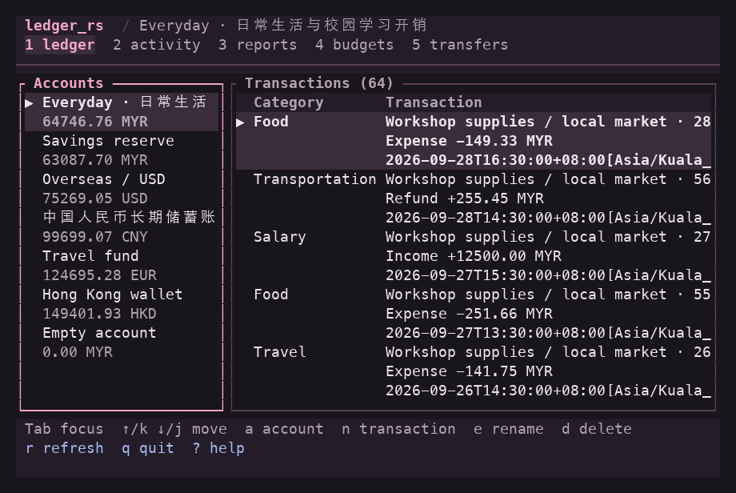

# ledger_rs

`ledger_rs` is a local personal accounting application written in Rust, and a
learning project for maintainable Rust software. Its command-line (CLI), terminal
(TUI), and browser (Web) interfaces share accounting rules and a SQLite ledger.

## What it does

- Manage accounts, income, expenses, expense refunds, and transfers.
- Track opening balances and dated balance reconciliations through the CLI.
- Set monthly category budgets and view account or portfolio reports, grouped
  by currency.
- Search transaction history, exchange CSV transactions, and back up or restore
  the ledger with versioned JSON through the CLI and Web.
- Preserve recorded time zones and an append-only database audit trail.

Supported currencies are CNY, USD, EUR, HKD, and MYR. Amounts use exact integer
minor units internally. There is no automatic currency conversion or exchange-rate
lookup. The Web interface is local-only; remote access, authentication, and
multi-device synchronization are not currently implemented.

## Install and run

Download an archive for your platform from
[GitHub Releases](https://github.com/singlelektron/ledger_rs/releases).
Choose **TUI** for CLI and terminal use, **Web** for CLI and browser use, or
**TUI and Web** for all three. Archives are available for Linux x86-64, Windows
x86-64, macOS Intel, and macOS Apple Silicon. They include SQLite and do not
require Rust to run.

Verify the download against its release's `SHA256SUMS`, then extract it. For an
existing ledger, read the release's upgrade instructions and make a backup
**before launching a new version**: opening the database can migrate its schema.
See the [v0.3.0 release notes](docs/releases/v0.3.0.md) for compatibility and
rollback instructions.

The `sh` examples use a POSIX-compatible shell such as Bash on Linux or macOS.
Run from the extracted directory:

```sh
./ledger_rs --help
./ledger_tui
./ledger_web
```

In Windows PowerShell, use `.\ledger_rs.exe --help`, `.\ledger_tui.exe`, or
`.\ledger_web.exe`. See the [PowerShell quick start](#windows-powershell) below.

Start the interface included in your download. For Web, open
`http://127.0.0.1:3000`; stop the server with Ctrl+C. It accepts only loopback
listen addresses and is intended for use on your own computer. For TUI, use a
terminal at least 80 columns by 24 rows, press `?` for help, and `q` to quit.
Every executable supports `--help` and `--version` without starting the interface.



## First CLI transaction

Use a new `demo.db` for these examples. An existing file is reused; substitute
the account ID printed by `account create` if it is not `1`. Choose the shell
example that matches your terminal; do not run both against the same demo ledger.

```sh
./ledger_rs --database demo.db account create --name Cash --currency cny
./ledger_rs --database demo.db transaction add \
  --account-id 1 --kind expense --amount-minor 1250 --currency cny \
  --occurred-at '2026-10-01T12:00:00+08:00[Asia/Shanghai]' \
  --description Lunch --category food
./ledger_rs --database demo.db account balance --id 1
```

### Windows PowerShell

From the extracted Windows release directory, run each command on one line:

```powershell
.\ledger_rs.exe --database demo.db account create --name Cash --currency cny
.\ledger_rs.exe --database demo.db transaction add --account-id 1 --kind expense --amount-minor 1250 --currency cny --occurred-at '2026-10-01T12:00:00+08:00[Asia/Shanghai]' --description Lunch --category food
.\ledger_rs.exe --database demo.db account balance --id 1
```

For other `sh` examples, remove each trailing backslash (`\`) and join the
continued lines with spaces. PowerShell does not use `\` for line continuation.
Use `.\ledger_rs.exe` in place of `./ledger_rs` and substitute Windows file paths,
quoting paths that contain spaces.

Either shell example records an expense of 12.50 CNY. With no other activity or
opening balance, the balance is `-1250 (Cny)` in CLI output. CLI and TUI amount
inputs use minor units; Web amount fields use decimal values such as `12.50`.
See the [usage guide](docs/usage.md) for editing, transfers, budgets, reports,
reconciliation, and interactive controls.

## Your data

All three interfaces select the same database in this order: `--database PATH`,
a nonempty `LEDGER_RS_DATABASE`, then the platform data directory. Relative paths
resolve from the launch directory. Use an absolute path when starting from
different launchers.

The [database guide](docs/database.md#database-location) lists exact platform
paths, the legacy `./ledger.db` fallback, and file permissions. Keep your ledger
and backups outside the extracted release directory so replacing executables
does not replace your data.

Use [JSON backup and recovery](docs/database.md#backup-and-recovery) for a full
ledger backup. CSV exchanges transactions only, and importing the same file twice
creates duplicates. Restore requires an empty target ledger; try recovery in a
separate database before relying on a backup.

## Build from source

Install a current stable Rust toolchain with Rust 2024 support, then run in the
repository:

```sh
cargo build --locked --bins
cargo run --bin ledger_rs -- --help
```

The default build includes CLI, TUI, and Web. Start an interactive interface with
`cargo run --bin ledger_tui` or `cargo run --bin ledger_web`. The
[development guide](docs/development.md) covers optional interface builds,
verification, contribution, and release procedures.

## For the project owner

Start with an AI-generated PR's **Owner Review**, then follow
[how to evaluate and accept a PR](docs/development.md#review-a-pr-as-the-project-owner).
The guide explains practical acceptance, verification evidence, and the separate
decisions to accept a change, authorize a merge, and authorize a release.

## Documentation and contributions

| Document | Use it for |
| --- | --- |
| [Usage](docs/usage.md) | Everyday workflows and interface controls |
| [Database](docs/database.md) | Storage paths, CSV, migrations, backup, recovery, and audit history |
| [Architecture](docs/architecture.md) | Shared-core boundaries, accounting invariants, and design rationale |
| [Development](docs/development.md) | Build checks, contribution, release safeguards, and documentation policy |
| [Web design](docs/ui/web-design.md) | Visual and accessibility conventions |
| [Release notes](docs/releases/v0.3.0.md) | Version-specific changes and upgrade compatibility |
| [Agent instructions](https://github.com/singlelektron/ledger_rs/blob/master/AGENTS.md) | AI development workflow and safety boundaries |

Report problems and track planned work in
[Issues](https://github.com/singlelektron/ledger_rs/issues). Include the version,
interface, steps to reproduce, and expected result; use synthetic data rather
than a private ledger. Changes follow a focused branch and Pull Request workflow.
Completed work and review evidence belong in
[Pull Requests](https://github.com/singlelektron/ledger_rs/pulls) and Releases.
