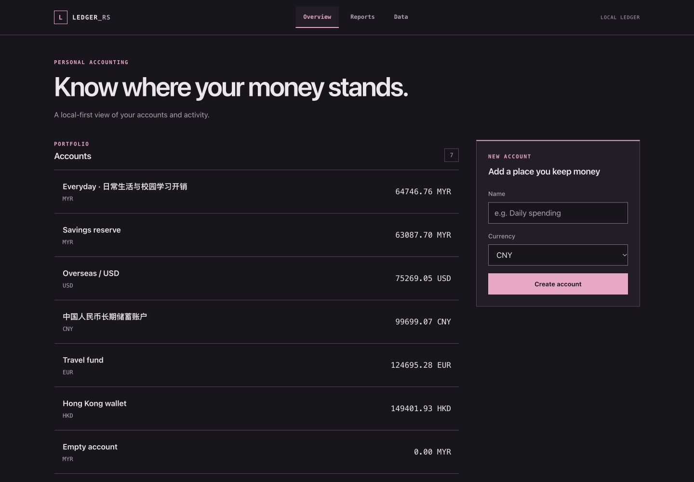
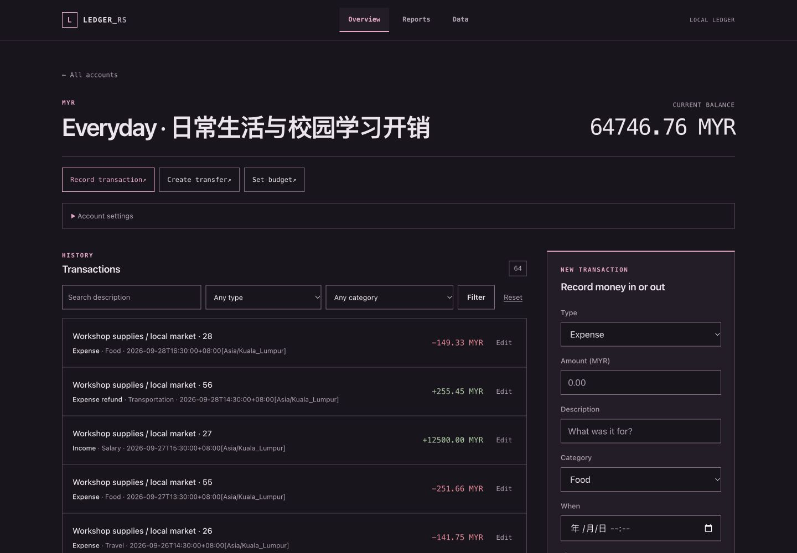
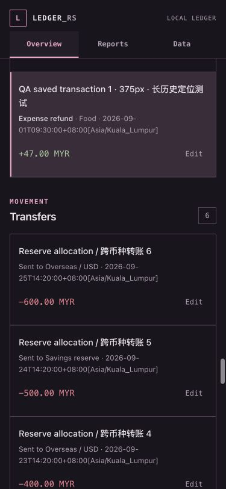

# Web visual design and verification

The Web UI uses the Configs dark-rose palette with square panels, fine dividers,
system sans-serif text, and monospaced tabular amounts. Typography separates
page headings, section labels, and supporting text, informed by
[Geist's typography reference](https://vercel.com/geist/typography).

| Role | Color |
| --- | --- |
| Canvas / panel | `#19151c` / `#241d29` |
| Text / secondary text | `#ede5ec` / `#b3a2b1` |
| Accent / selection | `#f2a5c7` / `#3b2c3b` |
| Decorative divider / control boundary | `#574254` / `#876b82` |
| Positive / negative | `#a6c7a0` / `#f08091` |

Control boundaries have at least 3.47:1 contrast against the main surfaces;
secondary text has at least 6.80:1. A visible rose outline marks keyboard focus.
Primary controls and row actions have a minimum height of 44 px. No remote
fonts, scripts, images, or new dependencies are required.

Navigation remains available on narrow screens. The first Tab stop skips to
main content, and account action links focus their form panels. Monthly report
tables have focusable scroll containers. Edited transactions retain their
stable anchors and highlighted rows; scroll offsets account for the 73 px
desktop and 97 px mobile sticky headers.

## Scope

Only CSS, the shared HTML shell, presentation markup, UI tests, and documentation
change. Navigation selection is explicit and independent of account names.
Routes, POST actions, named form controls, query parameters, amount units,
validation, database schema, and application/domain calculations are unchanged.
The TUI redesign is delivered independently in PR #45.

## Automated verification

Run on 2026-10-01:

- `cargo fmt --check`
- `cargo check --locked --workspace --all-features`
- `cargo test --locked --workspace --all-features`: 332 tests passed
  (325 library, 5 binary, 2 integration tests), including 37 Web tests.
- For each feature profile below, strict Clippy, tests, and binary builds passed:

| Profile | Flags |
| --- | --- |
| CLI core | `--no-default-features` |
| TUI | `--no-default-features --features tui` |
| Web | `--no-default-features --features web` |
| Combined | `--no-default-features --features tui,web` |

Commands for each profile:

```sh
cargo clippy --locked <flags> --all-targets -- -D warnings
cargo test --locked <flags> --lib --bins
cargo build --locked <flags> --bins
```

New tests cover explicit navigation, the skip link and focusable main landmark,
unique account-action targets with one or multiple accounts, accessible search,
and escaped error messages with unchanged HTTP status. Existing tests continue
to cover transaction redirects, form values, time zones, security headers,
account/transaction/transfer/budget behavior, reports, and data import/export.

## Browser evidence

Actual browser captures use isolated synthetic SQLite ledgers under a temporary
directory; no user ledger was opened. The initial fixture has seven accounts,
five currencies, 72 transactions, six transfers, four budgets, Chinese names,
long descriptions, and an empty account.

The 40-view matrix covers Overview, Account, long text, empty account,
transaction editor, transfer editor, single-account report, portfolio report,
Data, and error pages at widths 1440, 768, 375, and 320 px. No page-wide
horizontal overflow, missing control labels, undersized primary targets, or
rounded primary components were found. Wide report tables scroll within their
own containers.

Additional stress checks used a separate editable fixture with an `i64::MAX`
minor-unit amount (`92233720368547758.07 EUR`) and a 130-character mixed Chinese/
Latin account name. Overview, account, report, and editor pages remained within
the viewport at all four widths.

Keyboard checks confirmed that Tab reaches the skip link first, Enter moves
focus to main content, each account shortcut focuses its target panel, and the
next Tab reaches its first field. ArrowRight moved a focused report container
from scroll position 0 to 109 px without moving the document horizontally.

Actual edit-and-save checks used a transaction deep in the history:

| Width | Header bottom | Returned row top | Document scroll |
| --- | --- | --- | --- |
| 1440 px | 73 px | 95.84 px | 6024.5 px |
| 375 px | 97 px | 119.80 px | 10507 px |

Both saves returned to `#transaction-1`, with the highlighted row visible below
the sticky header. No user data was involved in these writes. The contrast-only
control-border adjustment was followed by fresh browser captures and a second
successful run of the automated validation matrix.

Browser evidence is from Chromium; other browser engines were not exercised.
Native date/time widgets follow the browser's locale.

### Overview · 1440 px



### Account · 1440 px



### Saved transaction · 375 px


